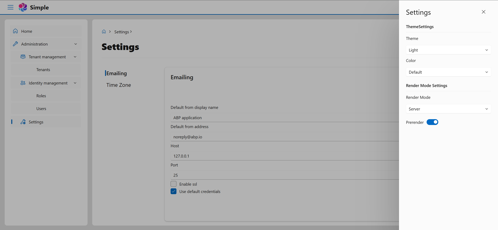
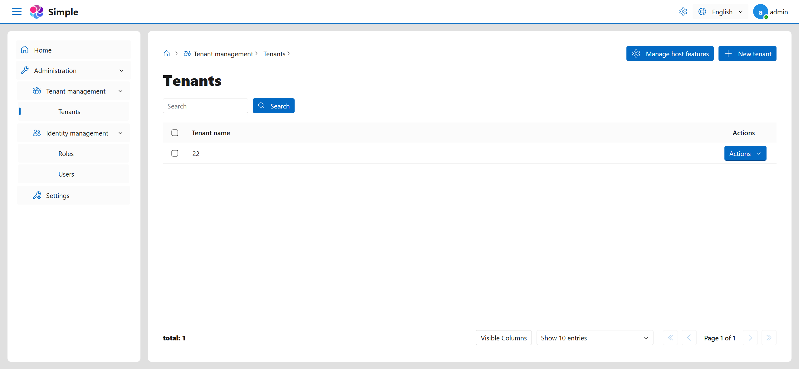
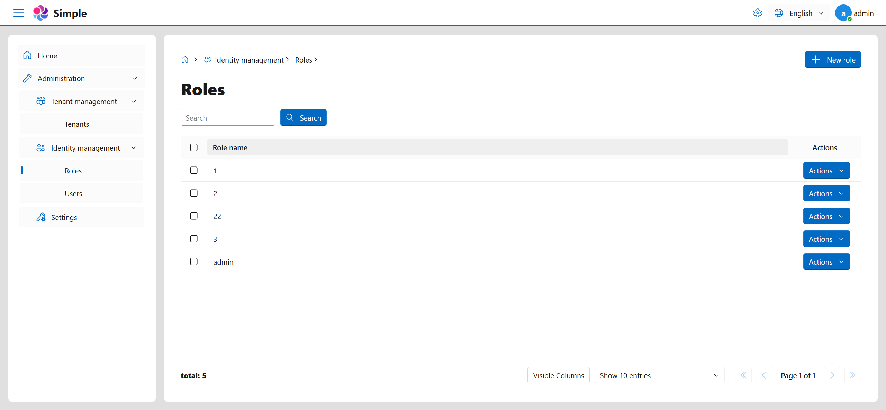
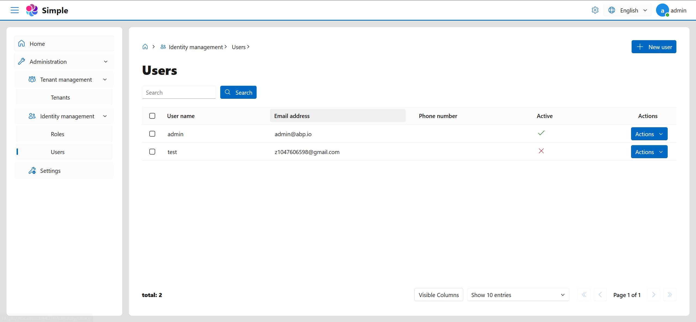
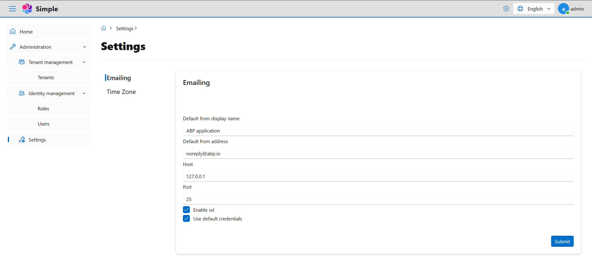
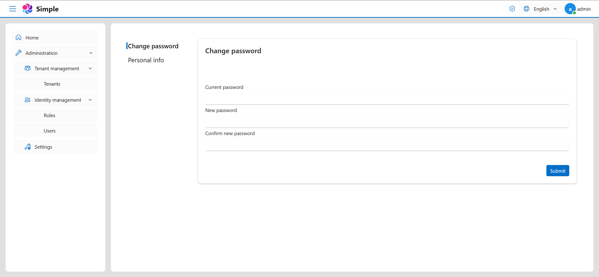

# Zyknow.Abp.FluentDesignUI

---

## 📖 Introduction

**Fluent Design UI Implementation for ABP Framework (Pure Blazor)**

This project is developed on **.NET 9** and **ABP v9.x**, focusing on completely replacing ABP's original Blazor UI with
**[FluentBlazor](https://github.com/microsoft/fluentui-blazor)**. All default ABP UI components, layouts, and styles
have been reimplemented using FluentBlazor to provide a clean and modern Fluent Design experience.

Inspired by the work done in **[Lsw.Abp.AntDesignUI](https://github.com/realLiangshiwei/Lsw.Abp.AntDesignUI)**, this
implementation aims to enhance the user interface and user experience by leveraging the principles of Fluent Design. By
integrating FluentBlazor, the project ensures a seamless and visually appealing interface that aligns with contemporary
design standards, making it easier for developers to create responsive and engaging applications within the ABP
framework.

With this initiative, we aim to modernize the look and feel of ABP applications while providing developers with a robust
set of tools and components that are easy to use and customize, fostering a more efficient development process.

## ✨ Highlights

- ✅ **Fully Pure Blazor** implementation without `abp install-libs` (**Not MVC**).
- ✅ Comprehensive replacement of default ABP Blazor UI components.
- ✅ Modern and intuitive UI powered by **FluentBlazor**.

## 🚀 Getting Started

[Setup-Guide](./README.Setup-Guide.md)

## 🗺️ Roadmap

- [x] Mobile Support[README.Start.md](README.Start.md)
- [x] Custom Pagination
- [ ] Multiple Tabs
- [ ] Publish NuGet Package
- [ ] ABP CMS FluentUI Theme Module
- [ ] ABP Docs FluentUI Theme Module
- [ ] Migration to FluentBlazor V5 (wait for V5 release)

## 🖼️ Screenshots

| Feature                | Screenshot                                                  |
|------------------------|-------------------------------------------------------------|
| Login                  |                              |
| Toolbar Settings Panel |  |
| Tenants                |                          |
| Roles                  |                              |
| Users                  |                              |
| Settings               |                        |
| Profiles               |                        |

## 🤝 Contributing

We welcome contributions! Please follow the guidelines below:

### Commit Message Guidelines

When contributing, please adhere to the following commit message conventions inspired by
the [Angular Commit Message Guidelines](https://github.com/conventional-changelog/conventional-changelog/tree/master/packages/conventional-changelog-angular):

- **`feat`**: Add new features
- **`fix`**: Fix a bug or issue
- **`style`**: Code style changes that do not affect functionality
- **`perf`**: Optimization or performance improvements
- **`refactor`**: Code restructuring without changing functionality
- **`revert`**: Undo a previous commit
- **`test`**: Changes related to tests
- **`docs`**: Documentation updates or notes
- **`chore`**: Dependency updates or configuration changes
- **`workflow`**: Improvements to the workflow
- **`ci`**: Changes related to continuous integration
- **`types`**: Modifications to type definition files
- **`wip`**: Work in progress

Thank you for contributing!

## License

**[MIT license](LICENSE)**

Stay tuned for updates!
