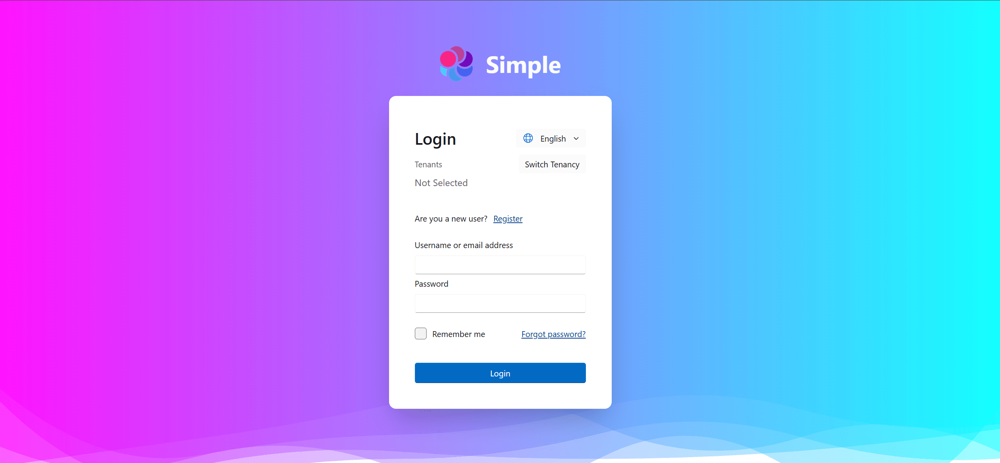
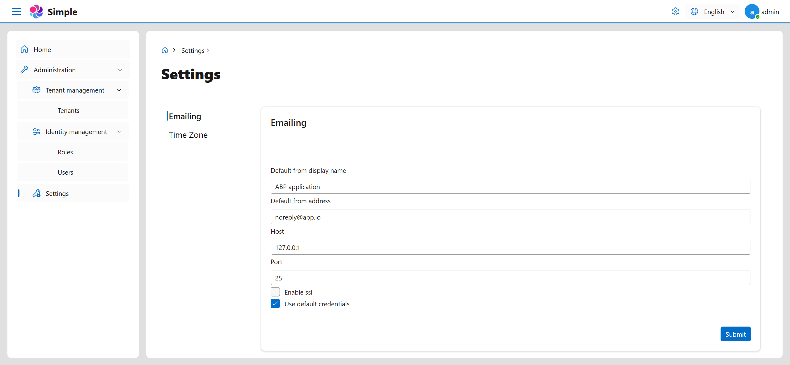

# Zyknow.Abp.FluentDesignUI

**Fluent Design UI Implementation for ABP Framework (Pure Blazor)**

This project is developed based on `.NET 9` and `ABP v9.x`, focusing on completely replacing ABP's original Blazor UI with **FluentBlazor**. All default ABP UI components, layouts, and styles have been reimplemented using FluentBlazor, providing a clean and modern Fluent Design experience.

## ✨ Highlights

- ✅ Fully **Pure Blazor** implementation without `abp install-libs` (**No MVC**).
- ✅ Comprehensive replacement of default ABP Blazor UI components.
- ✅ Modern and intuitive UI powered by **FluentBlazor**.
## Quick View

| Login | Tenants |
|-------|---------|
|  |  |

| Roles | Users |
|-------|-------|
|  |  |

| Settings | Profiles |
|----------|----------|
|  |  |

## 📦 Installation

Detailed installation instructions coming soon...

## 🗺️ Roadmap

Stay tuned for updates!
